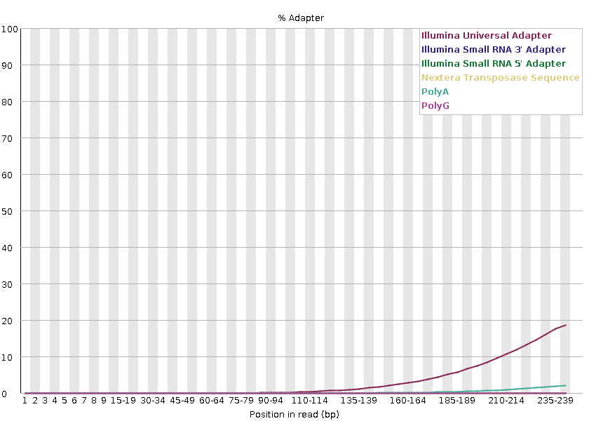
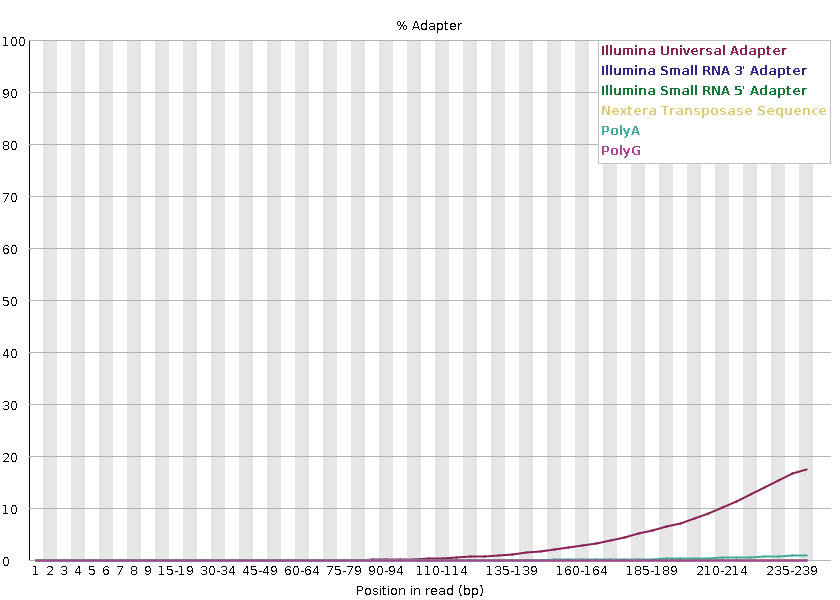

<h1 align="center">
<b>Adapter content</b>
</h1>

The plot shows the cumulative percentage of reads with the different adapter sequences at each position.
Once an adapter sequence is seen in a read it is counted as being present right through to the end of the read so the percentage increases with the read length.
FastQC can detect some adapters by default (e.g. Illumina, Nextera), for others we could provide a contaminants file as an input to the FastQC tool.

Ideally Illumina sequence data should not have any adapter sequence present.
But with long reads, some of the library inserts are shorter than the read length resulting in read-through to the adapter at the 3’ end of the read.

=== "Forward"
    !!! quote "Figure"
        <figure markdown>
        
        </figure>
=== "Reverse"
    !!! quote "Figure"
        <figure markdown>
        
        </figure>
